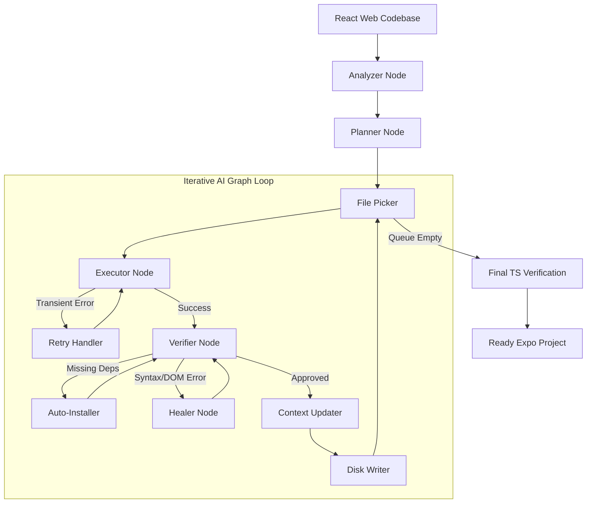

# ⚛️ Retransify (React to React Native/Expo CLI)

<div align="center">


**Autonomously transition your existing React Web codebases to Production-Ready React Native Expo Mobile Apps via intelligent AI parsing.**

</div>

## 📋 Table of Contents

- [📖 Overview](#-overview)
- [🚀 Why Retransify?](#-why-retransify)
- [✨ Key Features (Latest Updates)](#-key-features)
- [🛠️ Architecture & Workflow](#-architecture--workflow)
- [🚀 Getting Started](#-getting-started)
- [📱 Usage](#-usage)
- [📂 Project Structure](#-project-structure)
- [🤝 Contributing (Open Source)](#-contributing)
- [📄 License](#-license)

---

## 📖 Overview

**Retransify** is a sophisticated CLI tool engineered to dramatically accelerate the migration of React Web applications to React Native (Expo).

Rebuilt on the latest **LangGraph** framework, Retransify acts as an intelligent set of collaborative autonomous agents. It structurally analyzes your web project down to the Abstract Syntax Tree (AST), understands deep functional relationships, logically maps complex web-routing structures, rewrites UI components flawlessly, and auto-installs mandatory mobile dependencies on the fly.

## 🚀 Why Retransify?

Transitioning from web to mobile has traditionally been a highly tedious, manual process. Retransify automates these painful tasks by:

- **Replacing brute-force translation with AST precision:** Understands the actual _intent_ and design of your code by parsing the Abstract Syntax Tree using `ts-morph`.
- **Advanced Agentic Graph:** Uses an intelligent feedback loop (Write ➡️ Verify ➡️ Heal) mirroring human pair programming.
- **Expo & NativeWind Modern Standards:** Output code is clean, TypeScript-ready, compatible with the newest Expo Router paradigms (SDK 54+), and seamlessly manages NativeWind v4 integrations.

## ✨ Key Features

Our latest architectural overhaul introduces cutting-edge capabilities:

- **🧠 Cyclical AI Workflow (Powered by LangGraph)**:
  - **Analyzer Node**: Uses `ts-morph` to extract the full tech stack, entry points, and source roots without guessing.
  - **Planner Node**: Generates a deterministic conversion map and file priority queue.
  - **Layout Agent Node**: Synthesizes complex `expo-router` structures (Tabs, Drawers, Modals) with perfect preservation of global providers.
  - **Executor Node**: Transforms components with high fidelity, injecting JIT context (RAG) for localized imports.
  - **Verifier Node**: Actively analyzes AST structure to mathematically flag leftover DOM elements, syntax errors, and faulty routing.
  - **Healer Node**: Dynamically corrects AI-generated code based on verifier feedback without user intervention.
  - **Auto-Installer Node**: Maps and installs React Native-compatible alternatives for web packages.
- **🛤️ Intelligent Route Projection**:
  - Automatically maps React Router / Next.js routes to the Expo `app/` directory structure.
  - Supports dynamic segments, groups, and complex layout nesting.
- **🛡️ Resilience & Reliability**:
  - **Structural Contract Enforcement (AST-driven)**: Eliminates cross-file "hallucination" by extracting precise, machine-readable function signatures (parameters, destructured shapes, and types) into a central **ContractRegistry**.
  - **Authoritative Prompting**: Injects exact call-site contracts into the LLM workspace, ensuring functions are called with the correct object shapes.
  - **Cross-File Verification**: The Verifier mathematically validates that generated code conforms to imported function contracts before finalizing the file.
  - **Strict Type Diagnostics**: Uses an ephemeral strict TypeScript project pass to catch deep type-safety violations across file boundaries.
  - **Multi-Model Fallback**: Automatically retries transient API errors (503/429) and switches providers if necessary.
- **🎨 NativeWind v4 Integration**:
  - Complete support for modern styling. Detects Tailwind setups, configures `global.css`, and handles responsive class mappings.
- **⚙️ Dynamic Expo Configuration**:
  - Automatically syncs `app.json` metadata (name, slug, scheme) with the source project's `package.json` to ensure professional branding and valid deep-linking out of the box.
- **🩺 Retransify Doctor**:
  - A built-in diagnostic tool to verify the health of the migrated project and fix broken dependencies.


---

## 🛠️ Architecture & Workflow

Retransify utilizes a rigorous agentic graph logic to ensure maximum output reliability:



## 🚀 Getting Started

### Prerequisites

- [Node.js](https://nodejs.org/) (v22 recommended)
- [npm](https://www.npmjs.com/) or [yarn](https://yarnpkg.com/)
- Developer API Key for **Gemini** (Primary) or **Groq** (Secondary)

### Installation

1. **Clone the repository**:
   ```bash
   git clone <repository-url>
   cd retransify
   npm install
   ```

2. **Link the CLI locally**:
   ```bash
   npm link
   ```

### Configuration

Create a `.env` file in the root project directory:

```env
AI_PROVIDER=gemini
GEMINI_API_KEY=your_gemini_api_key
GROQ_API_KEY=your_groq_api_key
# Optional: Set secondary model for fallback
SECONDARY_MODEL=gemini-1.5-flash
```

---

## 📱 Usage

### 🏎️ Convert a Project
Migrate your React web project to Expo:
```bash
retransify convert ./path-to-react-app --sdk 54
```

### 🩺 Health Check
Verify and fix dependencies in a migrated project:
```bash
retransify doctor ./path-to-expo-app
```

---

## 📂 Project Structure

```text
retransify/
├── cli.js                # Entry point
└── src/
    ├── cli/              # CLI logic & Interactive UI
    ├── core/
    │   ├── ai/           # AI Multi-Provider Factory
    │   ├── graph/        # LangGraph Workflow & Node definitions
    │   ├── scanners/     # AST Route Analyzers & File Scanners
    │   ├── services/     # Project Init & Style Config
    │   ├── prompt/       # Smart Prompt Synthesis (RAG)
    │   ├── detectors/    # Framework & Stack Detection
    │   ├── helpers/      # Dependency Map & Path Mapping
    │   └── utils/        # UI formatting & Verifier helpers
    ├── templates/        # SDK Base Templates (SDK 54+)
    └── config/           # Library rules & Mobile mappings
```

---

## 🤝 Contributing

**Retransify is fully open source**, and we deeply welcome contributions! Whether you want to refine our AST logic, introduce new Agent nodes, or support new AI models, your help is valued.

---

## 📄 License

This open-source project is distributed under the **Apache License 2.0**.
