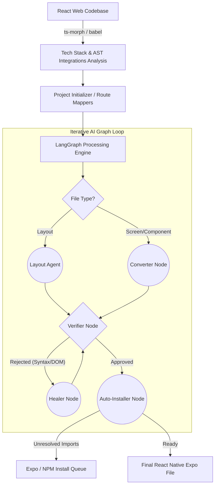

# ⚛️ Retransify (React to React Native/Expo CLI)

<div align="center">


**Autonomously transition your existing React Web codebases to Production-Ready React Native Expo Mobile Apps via intelligent AI parsing.**

</div>

## 📋 Table of Contents

- [📖 Overview](#-overview)
- [🚀 Why Retransify?](#-why-retransify)
- [✨ Key Features (Latest Updates)](#-key-features)
- [🛠️ Architecture & Workflow](#-architecture--workflow)
- [🚀 Getting Started](#-getting-started)
- [📱 Usage](#-usage)
- [📂 Project Structure](#-project-structure)
- [🤝 Contributing (Open Source)](#-contributing)
- [📄 License](#-license)

---

## 📖 Overview

**Retransify** is a sophisticated CLI tool engineered to dramatically accelerate the migration of React Web applications to React Native (Expo).

Rebuilt on the latest **LangGraph** framework, Retransify acts as an intelligent set of collaborative autonomous agents. It structurally analyzes your web project down to the Abstract Syntax Tree (AST), understands deep functional relationships, logically maps complex web-routing structures, rewrites UI components flawlessly, and auto-installs mandatory mobile dependencies on the fly.

## 🚀 Why Retransify?

Transitioning from web to mobile has traditionally been a highly tedious, manual process. Retransify automates these painful tasks by:

- **Replacing brute-force translation with AST precision:** Understands the actual _intent_ and design of your code by parsing the Abstract Syntax Tree.
- **Advanced Agentic Graph:** Uses an intelligent feedback loop (Write ➡️ Verify ➡️ Heal) mirroring human pair programming.
- **Expo & NativeWind Modern Standards:** Output code is clean, TypeScript-ready, compatible with the newest Expo Router paradigms, and seamlessly manages NativeWind / Tailwind integrations.

## ✨ Key Features

Our latest architectural overhaul introduces cutting-edge capabilities:

- **🧠 Cyclical AI Workflow (Powered by LangGraph)**:
  - **Layout Agent Node**: A specialized agent dedicated to synthesizing complex `expo-router` structures (Tabs, Drawers, Modals) with perfect preservation of global providers and wrappers.
  - **Converter Node**: Transforms standard components with high fidelity while injecting deterministic dependency mappings.
  - **Verifier Node**: Actively analyzes the AI-generated code’s AST structure to mathematically flag leftover web DOM elements, standard unhandled syntax errors, and faulty routing structures.
  - **Healer Node**: Takes rejected verifier metrics and dynamically corrects the AI-generated code without user intervention.
- **🛤️ Deterministic Path Mapping**:
  - Moves beyond AI "guessing" to precise AST-based resolution for imports and navigation.
  - Ensures accurate relative paths for global assets like `global.css` across nested directories.
- **🛡️ Resilience & Reliability**:
  - **Gemini Flash Fallback**: Automatically switches to lighter models if the primary provider is overloaded (503), ensuring zero downtime for large migrations.
- **🎨 Deep NativeWind Integration**:
  - Complete support for NativeWind v4. It detects existing Tailwind setups, builds `.css` configurations, and correctly formats modern JSX `className` elements with TypeScript safety.
- **📦 Auto Installer Node**:
  - Dynamically discovers React Native-compatible alternatives for web packages and manages installations automatically during the graph execution.
- **✨ Professional Interactive CLI**:
  - Real-time tree-structured terminal interactions mapped seamlessly via a bespoke UI engine allowing clear insights without console clutter.

---

## 🛠️ Architecture & Workflow

Security and code integrity are prioritized via localized generation. Retransify utilizes a rigorous agentic graph logic to ensure maximum output reliability:



## 🚀 Getting Started

### Prerequisites

- [Node.js](https://nodejs.org/) (v20+ recommended)
- [npm](https://www.npmjs.com/) or [yarn](https://yarnpkg.com/)
- Developer API Key for **Gemini** (recommended) or **Groq**

### Installation

1. **Clone the repository**:
   ```bash
   git clone <repository-url>
   cd retransify
   npm install
   ```

2. **Link the CLI locally**:
   ```bash
   npm link
   ```

### Configuration

Create a `.env` file in the root project directory:

```env
AI_PROVIDER=gemini
GEMINI_API_KEY=your_gemini_api_key
GROQ_API_KEY=your_groq_api_key
# Optional: Set secondary model for fallback
SECONDARY_MODEL=gemini-1.5-flash
```

---

## 📱 Usage

```bash
retransify convert ./path-to-your-react-web-app
```

---

## 📂 Project Structure

```text
retransify/
├── cli.js                # Command Line Tool Initializer
└── src/
    ├── cli/              # UI workflows & interactive components
    ├── core/
    │   ├── ai/           # Agent Wrappers & Fallback Logic
    │   ├── graph/        # Core LangGraph execution & Nodes
    │   ├── parsers/      # Babel/AST execution layers
    │   ├── prompt/       # Instruction synthesis
    │   ├── scanners/     # RouteAnalyzers & file scanners
    │   ├── services/     # ProjectInitializer, StyleConfigurator
    │   └── utils/        # UI helpers & pure functions
    └── types.js          # Definitions core
```

---

## 🤝 Contributing

**Retransify is fully open source**, and we deeply welcome contributions from the advanced React / AI developer community! Whether you want to refine our AST logic, introduce new Agent nodes to the LangGraph core, or support new AI frameworks logic, your help is incredibly valued.

---

## 📄 License

This open-source project is distributed under the **Apache License 2.0**.
