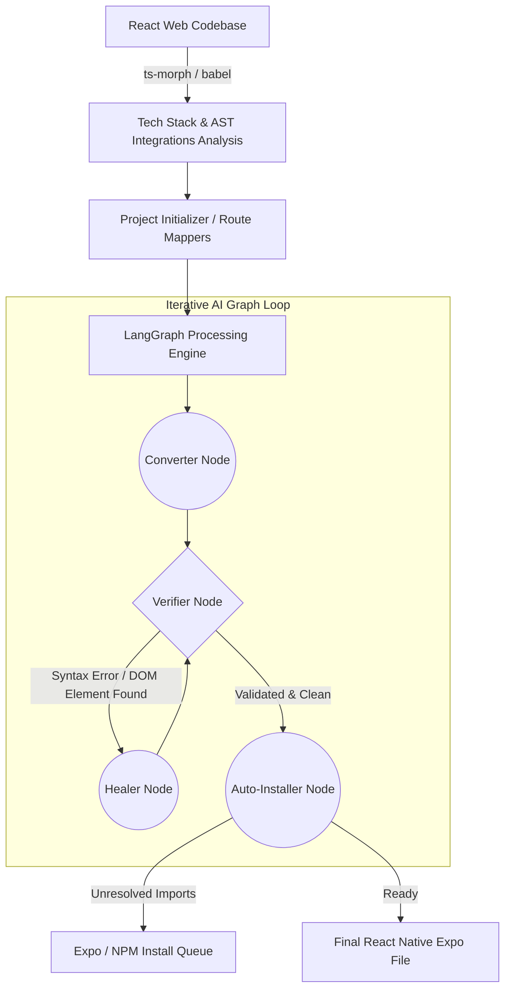

# ⚛️ Retransify (React to React Native/Expo CLI)

<div align="center">


**Autonomously transition your existing React Web codebases to Production-Ready React Native Expo Mobile Apps via intelligent AI parsing.**

</div>

## 📋 Table of Contents

- [📖 Overview](#-overview)
- [🚀 Why Retransify?](#-why-retransify)
- [✨ Key Features (Latest Updates)](#-key-features)
- [🛠️ Architecture & Workflow](#-architecture--workflow)
- [🚀 Getting Started](#-getting-started)
- [📱 Usage](#-usage)
- [📂 Project Structure](#-project-structure)
- [🤝 Contributing (Open Source)](#-contributing)
- [📄 License](#-license)

---

## 📖 Overview

**Retransify** is a sophisticated CLI tool engineered to dramatically accelerate the migration of React Web applications to React Native (Expo). 

Rebuilt on the latest **LangGraph** framework, Retransify acts as an intelligent set of collaborative autonomous agents. It structurally analyzes your web project down to the Abstract Syntax Tree (AST), understands deep functional relationships, logically maps complex web-routing structures, rewrites UI components flawlessly, and auto-installs mandatory mobile dependencies on the fly.

## 🚀 Why Retransify?

Transitioning from web to mobile has traditionally been a highly tedious, manual process of translating routing algorithms, replacing `<div>` tags with `<View>`, migrating stylesheets, and painstakingly resolving native dependencies. Retransify automates these painful tasks by:

- **Replacing brute-force translation with AST precision:** Understands the actual *intent* and design of your code by parsing the Abstract Syntax Tree.
- **Advanced Graph Machine Learning:** Uses an intelligent continuous feedback loop (Write ➡️ Verify ➡️ Heal) mirroring human pair programming methodologies.
- **Expo & NativeWind Modern Standards:** Output code is clean, TypeScript-ready, compatible with the newest Expo Router paradigms, and seamlessly manages NativeWind / Tailwind integrations.

## ✨ Key Features 

Our latest architectural overhaul introduces cutting-edge capabilities transforming how migrations are handled step-by-step:

- **🧠 Cycical AI Workflow (Powered by LangGraph)**:
    - **Verifier Node**: Actively analyzes the AI-generated code’s AST structure to mathematically flag leftover web DOM elements (`div`, `span`, `img`, `onClick`), standard unhandled syntax errors, and faulty routing structures.
    - **Healer Node**: Takes rejected verifier metrics and dynamically corrects the AI-generated code without user intervention.
- **🛤️ Dynamic AST-Based Route Mapping**: 
    - Intelligent translation of `react-router-dom` to **Expo Router File-Based structures**. 
    - Smoothly translates web nested dynamic segments (e.g. `/:id`) directly into bracket-syntax (`[id].tsx`) and logically maps legacy hooks like `useParams` to Expo’s `useLocalSearchParams`.
- **🎨 Deep NativeWind Integration**:
    - Complete support for NativeWind processing. It detects existing Tailwind setups, seamlessly builds `.css` configurations globally in the new environment, handles TypeScript structural limitations smoothly, and correctly formats modern JSX `className` elements.
- **📦 Auto Installer Node**:
    - During parsing, our Agent strictly tracks unrecognized third-party module imports in transformed files, dynamically discovering React Native-compatible alternatives and installing them automatically.
- **⚡ Multiple AI Integrations**:
    - First-class API integrations for Google **Gemini** (Pro & Flash models) and **Groq** (Llama 3, Mixtral).
- **✨ Professional Interactive CLI**: 
    - Real-time tree-structured terminal interactions mapped seamlessly via a bespoke UI engine allowing clear insights without console clutter.

---

## 🛠️ Architecture & Workflow

Security and code integrity are structurally prioritized via localized generation. Retransify utilizes a rigorous agentic graph logic to ensure maximum output reliability:



## 🚀 Getting Started

### Prerequisites

- [Node.js](https://nodejs.org/) (v18+ strictly required)
- [npm](https://www.npmjs.com/) or [yarn](https://yarnpkg.com/)
- Developer API Key for **Gemini** or **Groq**

### Installation

1. **Clone the repository**:

   ```bash
   git clone <repository-url>
   cd retransify-local
   npm install
   ```

2. **Link the CLI locally (Optional but recommended)**:
   ```bash
   npm link
   ```

### Configuration

Create a `.env` file in the root project directory specifying your dedicated intelligence provider:

```env
# Choose provider ('gemini' or 'groq')
AI_PROVIDER=gemini

# Official Provider API Keys
GEMINI_API_KEY=your_gemini_api_key
GROQ_API_KEY=your_groq_api_key
```

---

## 📱 Usage

The Retransify engine is fully **interactive**. Run the convert wrapper to begin the migration wizard:

```bash
# Start your targeted project conversion
node cli.js convert ./path-to-your-react-web-app
```

**Custom Runtime Options:**

- `--sdk <version>`: Explicitly target a specific Expo SDK version (e.g., `--sdk 50`).

---

## 📂 Project Structure

A quick overview of our internal modern graph architecture, for contributors looking to jump in:

```text
retransify-local/
├── cli.js                # Command Line Tool Initializer
├── package.json          # Node dependencies & Git workflow setups
└── src/
    ├── cli/              # Handling UI workflows, nested spinners, layout structures
    ├── core/
    │   ├── ai/           # Low-level Agent Wrappers & Models (Gemini, Groq)
    │   ├── commands/     # Commander.js executions logic
    │   ├── detectors/    # Stack resolving parsers via Package / TS Config definitions
    │   ├── graph/        # Core LangGraph execution state, edges, definitions, nodes
    │   │   └── nodes/    # Nodes list: verifierNode, healerNode, autoInstaller, converter  
    │   ├── parsers/      # Babel/AST execution layers 
    │   ├── prompt/       # Instruction synthesis and system tuning configurations
    │   ├── scanners/     # High-end RouteAnalyzers, file recursive readers
    │   ├── services/     # Cross-layer services: ProjectInitializer, StyleConfigurator
    │   └── utils/        # Extracted pure functions
    └── types.js          # Definitions core
```

---

## 🤝 Contributing 

**Retransify is fully open source**, and we deeply welcome contributions from the advanced React / AI developer community! Whether you want to refine our AST logic, introduce new Agent nodes to the LangGraph core, or support new AI frameworks logic, your help is incredibly valued.

### Contribution Guidelines

1. **Fork the Repository**: Establish a localized workspace on your profile.
2. **Setup the branch**: Work on isolated branches (e.g., `git checkout -b feature/langgraph-optimizer`).
3. **Commit Cleanly**: Adhere to functional commits focusing precisely on module additions.
4. **Validations & Testing**: Run `npm run lint` and `npm test` via vitest locally prior to confirming your PR.
5. **Open a Pull Request**: Fully explain what structural enhancements were added.

---

## 📄 License

This open-source project is distributed under the **Apache License 2.0**. You are free to use, modify, distribute, and contribute — just retain the original copyright notice. See the [LICENSE](./LICENSE) file for full details.
