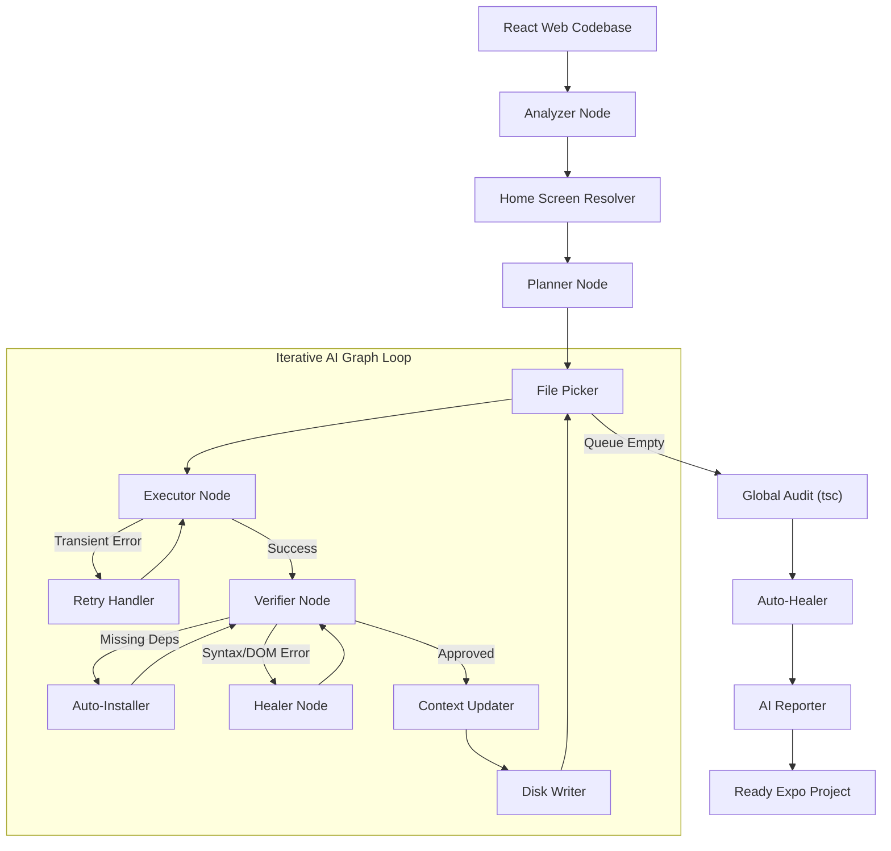

# ⚛️ Retransify (React to React Native/Expo CLI)

<div align="center">


<br />


**Autonomously transition your existing React Web codebases to Production-Ready React Native Expo Mobile Apps via intelligent AI parsing.**

</div>

## 📋 Table of Contents

- [📖 Overview](#-overview)
- [🚀 Why Retransify?](#-why-retransify)
- [✨ Key Features (Latest Updates)](#-key-features)
- [🛠️ Architecture & Workflow](#-architecture--workflow)
- [🚀 Getting Started](#-getting-started)
- [📱 Usage](#-usage)
- [📂 Project Structure](#-project-structure)
- [🤝 Contributing (Open Source)](#-contributing)
- [📄 License](#-license)

---

## 📖 Overview

**Retransify** is a sophisticated CLI tool engineered to dramatically accelerate the migration of React Web applications to React Native (Expo).

Rebuilt on the latest **LangGraph** framework, Retransify acts as an intelligent set of collaborative autonomous agents. It structurally analyzes your web project down to the Abstract Syntax Tree (AST), understands deep functional relationships, logically maps complex web-routing structures, rewrites UI components flawlessly, and auto-installs mandatory mobile dependencies on the fly.

## 🚀 Why Retransify?

Transitioning from web to mobile has traditionally been a highly tedious, manual process. Retransify automates these painful tasks by:

- **Replacing brute-force translation with AST precision:** Understands the actual _intent_ and design of your code by parsing the Abstract Syntax Tree using `ts-morph`.
- **Advanced Agentic Graph:** Uses an intelligent feedback loop (Write ➡️ Verify ➡️ Heal) mirroring human pair programming.
- **Expo & NativeWind Modern Standards:** Output code is clean, TypeScript-ready, compatible with the newest Expo Router paradigms (SDK 54+), and seamlessly manages NativeWind v4 integrations.

## ✨ Key Features

Our latest architectural overhaul introduces cutting-edge capabilities:

- **🧠 Cyclical AI Workflow (Powered by LangGraph)**:
  - **Analyzer Node**: Uses `ts-morph` to extract the full tech stack, entry points, and source roots without guessing.
  - **Planner Node**: Generates a deterministic conversion map and file priority queue.
  - **Layout Agent Node**: Synthesizes complex `expo-router` structures (Tabs, Drawers, Modals) with perfect preservation of global providers.
  - **Executor Node**: Transforms components with high fidelity, injecting JIT context (RAG) for localized imports.
  - **Verifier Node**: Actively analyzes AST structure to mathematically flag leftover DOM elements, syntax errors, and faulty routing.
  - **Healer Node**: Dynamically corrects AI-generated code based on verifier feedback without user intervention.
  - **Auto-Installer Node**: Maps and installs React Native-compatible alternatives for web packages.
  - **🔍 Global Audit Node**: Runs the native TypeScript compiler (`tsc --noEmit`) on the final project to intercept deep architectural errors.
  - **🩹 Auto-Healer Node**: Performs a final "polish" pass to automatically fix broken relative imports, missing assets, and style mismatches.
  - **📊 Reporter Node**: Generates a comprehensive AI-powered handoff report (`RETRANSIFY_REPORT.md`) summarizing the conversion success, healed items, and manual actions required.
- **🛤️ Intelligent Route Projection**:
  - Automatically maps React Router / Next.js routes to the Expo `app/` directory structure.
  - **Home Screen Resolver**: A specialized AST-tracing chain that discovers the *true* entry component by following the bootstrap path (e.g., `main.tsx` → `App.tsx` → Route `/`), rather than relying on filename guessing.
- **🛡️ Resilience & Reliability**:
  - **Structural Contract Enforcement (AST-driven)**: Eliminates cross-file "hallucination" by extracting precise, machine-readable function signatures (parameters, destructured shapes, and types) into a central **ContractRegistry**.
  - **Authoritative Prompting**: Injects exact call-site contracts into the LLM workspace, ensuring functions are called with the correct object shapes.
  - **Cross-File Verification**: The Verifier mathematically validates that generated code conforms to imported function contracts before finalizing the file.
  - **Multi-Model Fallback**: Automatically retries transient API errors (503/429) and switches providers if necessary.
- **🎨 NativeWind v4 Integration**:
  - Complete support for modern styling. Detects Tailwind setups, configures `global.css`, and handles responsive class mappings.
- **⚙️ Dynamic Expo Configuration**:
  - Automatically syncs `app.json` metadata (name, slug, scheme) with the source project's `package.json` to ensure professional branding and valid deep-linking out of the box.
- **🩺 Retransify Doctor**:
  - A built-in diagnostic tool to verify the health of the migrated project and fix broken dependencies.


---

## 🛠️ Architecture & Workflow

Retransify utilizes a rigorous agentic graph logic to ensure maximum output reliability. The process is divided into **Pre-flight Resolution** (detecting stack, resolving home screen, installing baseline deps) and the **Conversion Loop**.



## 🚀 Getting Started

### Prerequisites

- [Node.js](https://nodejs.org/) (v22 recommended)
- [npm](https://www.npmjs.com/)
- Developer API Key for **Gemini** (Primary)

### Installation

You can install Retransify globally to use it anywhere:

```bash
npm install -g retransify
```

*Alternatively, for development:*
1. Clone the repo and `cd retransify`
2. Run `npm install`
3. Run `npm link`

### 🔑 Configuration (API Key)

Retransify requires an AI provider to think. The easiest way is to set your Google API Key in your environment:

**Windows (PowerShell):**
```powershell
$env:GOOGLE_API_KEY = "your_key_here"
```

**Mac / Linux:**
```bash
export GOOGLE_API_KEY="your_key_here"
```

---

## 📱 Usage

### 🏎️ Convert a Project
Navigate to your directory and run the conversion. Retransify will **interactively** ask you for the new project name:

```bash
retransify convert ./path-to-react-app
```

**What happens next?**
1. ⌨️ **Input**: You'll be prompted for a project name (default is `your-app-mobile`).
2. 🏗️ **Scaffold**: A clean Expo SDK 54 project is created.
3. 🧠 **AI Flow**: The agentic graph starts analyzing and converting your files one by one.
4. 🩺 **Self-Heal**: The tool automatically fixes DOM leaks and missing native dependencies.

### 🩺 Health Check
Verify and fix dependencies in a migrated project:
```bash
retransify doctor ./path-to-expo-app
```

---

## 📂 Project Structure

```text
retransify/
├── cli.js                # Entry point
└── src/
    ├── cli/              # CLI logic & Interactive UI
    ├── core/
    │   ├── ai/           # AI Multi-Provider Factory
    │   ├── graph/        # LangGraph Workflow & Node definitions
    │   ├── scanners/     # AST Route Analyzers & File Scanners
    │   ├── services/     # Project Init & Style Config
    │   ├── prompt/       # Smart Prompt Synthesis (RAG)
    │   ├── detectors/    # Framework & Stack Detection
    │   ├── helpers/      # Dependency Map & Path Mapping
    │   └── utils/        # UI formatting & Verifier helpers
    ├── templates/        # SDK Base Templates (SDK 54+)
    └── config/           # Library rules & Mobile mappings
```

---

## 🤝 Contributing

**Retransify is fully open source**, and we deeply welcome contributions! Whether you want to refine our AST logic, introduce new Agent nodes, or support new AI models, your help is valued.

---

## 📄 License

This open-source project is distributed under the **Apache License 2.0**.
