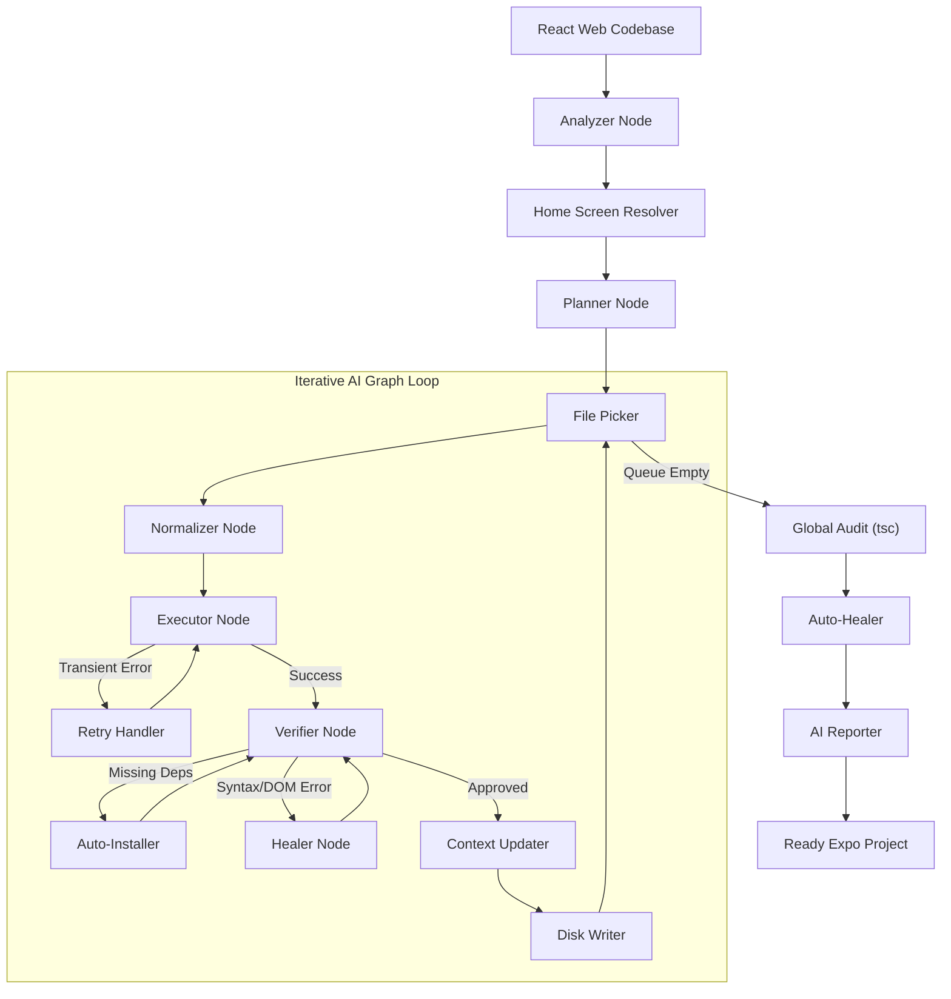

<table align="center" style="border-collapse: collapse; border: none;">
  <tr style="border: none;">
    <td align="center" style="border: none; padding: 20px;">
      
    </td>
    <td style="border: none; padding: 20px; vertical-align: middle;">
      <h1>Retransify</h1>
      <p>
        
        
        
        <br />
        
        
        
      </p>
    </td>
  </tr>
</table>

<p align="center">
  <b>Autonomously transition your existing React Web codebases to Production-Ready React Native Expo Mobile Apps via intelligent AI parsing.</b>
</p>

---

## 📋 Table of Contents

- [📖 Overview](#-overview)
- [🚀 Why Retransify?](#-why-retransify)
- [✨ Key Features (Latest Updates)](#-key-features)
- [🛠️ Architecture & Workflow](#-architecture--workflow)
- [🚀 Getting Started](#-getting-started)
- [📱 Usage](#-usage)
- [📂 Project Structure](#-project-structure)
- [🤝 Contributing (Open Source)](#-contributing)
- [📄 License](#-license)

---

## 📖 Overview

**Retransify** is a sophisticated CLI tool engineered to dramatically accelerate the migration of React Web applications to React Native (Expo).

Rebuilt on the latest **LangGraph** framework, Retransify acts as an intelligent set of collaborative autonomous agents. It structurally analyzes your web project down to the Abstract Syntax Tree (AST), understands deep functional relationships, logically maps complex web-routing structures, rewrites UI components flawlessly, and auto-installs mandatory mobile dependencies on the fly.

## 🚀 Why Retransify?

Transitioning from web to mobile has traditionally been a highly tedious, manual process. Retransify automates these painful tasks by:

- **Replacing brute-force translation with AST precision:** Understands the actual _intent_ and design of your code by parsing the Abstract Syntax Tree using `ts-morph`.
- **Advanced Agentic Graph:** Uses an intelligent feedback loop (Write ➡️ Verify ➡️ Heal) mirroring human pair programming.
- **Expo & NativeWind Modern Standards:** Output code is clean, TypeScript-ready, compatible with the newest Expo Router paradigms (SDK 54+), and seamlessly manages NativeWind v4 integrations.

## ✨ Key Features

Our latest architectural overhaul introduces cutting-edge capabilities:

- **🧠 Cyclical AI Workflow (Powered by LangGraph)**:
  - **Analyzer Node**: Uses `ts-morph` to extract the full tech stack, entry points, and source roots without guessing.
  - **Planner Node**: Generates a deterministic conversion map and file priority queue.
  - **Normalizer Node**: Pre-cleans raw web source code (removes ghost props, dead imports, and enforces strict TS interfaces) using a fast AI pass to prevent "garbage-in → garbage-out".
  - **Layout Agent Node**: Synthesizes complex `expo-router` structures (Tabs, Drawers, Modals) with perfect preservation of global providers.
  - **Executor Node**: Transforms components with high fidelity, injecting JIT context (RAG) and **dynamically declaring new npm dependencies** as needed.
  - **Verifier Node**: Actively analyzes AST structure using loaded global type definitions (Shims) to mathematically flag leftover DOM elements and syntax errors.
  - **Healer Node**: Dynamically corrects AI-generated code based on verifier feedback without user intervention.
  - **Auto-Installer Node**: Maps and installs React Native-compatible alternatives for web packages.
  - **🔍 Global Audit Node**: Runs the native TypeScript compiler (`tsc --noEmit`) on the final project to intercept deep architectural errors.
  - **🩹 Auto-Healer Node**: Performs a final "polish" pass to automatically fix broken relative imports, missing assets, and style mismatches.
  - **📊 Reporter Node**: Generates a comprehensive AI-powered handoff report (`RETRANSIFY_REPORT.md`) summarizing the conversion success, healed items, and manual actions required.
- **🛤️ Intelligent Route Projection**:
  - Automatically maps React Router / Next.js routes to the Expo `app/` directory structure.
  - **Home Screen Resolver**: A specialized AST-tracing chain that discovers the *true* entry component by following the bootstrap path (e.g., `main.tsx` → `App.tsx` → Route `/`), rather than relying on filename guessing.
- **🔄 Hybrid Resume System**:
  - Intelligent resumption of interrupted migrations using **content hashing**.
  - Automatically skips files that haven't changed since the last run to save time and API costs.
- **📊 Academic Telemetry (Thesis Mode)**:
  - Deep tracking of **LLOC** (Logical Lines of Code), **Token Usage** (Input/Output), and **Cost Estimation (USD)**.
  - Automatically generates a comprehensive `retransify-metrics.csv` for auditing and academic performance analysis.
  - Enabled via `THESIS_MODE=true` environment variable.
- **🛡️ Resilience & Reliability**:
  - **Fail-Safe Disk Writing**: Atomic file operations to prevent code corruption during interruptions.
  - **Transient Error Handling**: Automatic retries for API errors (503/429) with exponential backoff.
  - **Enhanced Summary Reporting**: The CLI now tracks "Files with issues" separately from failures, providing a granular look at items requiring manual polish.
  - **Structural Contract Enforcement (AST-driven)**: Eliminates cross-file "hallucination" by extracting precise signatures into a central **ContractRegistry**.
- **🎨 NativeWind v4 Integration**:
  - Complete support for modern styling. Detects Tailwind setups, configures `global.css`, and handles responsive class mappings.
- **⚙️ Dynamic Expo Configuration**:
  - Automatically syncs `app.json` metadata (name, slug, scheme) with the source project's `package.json` to ensure professional branding and valid deep-linking out of the box.
- **🩺 Retransify Doctor**:
  - A built-in diagnostic tool to verify the health of the migrated project and fix broken dependencies.


---

## 🛠️ Architecture & Workflow

Retransify utilizes a rigorous agentic graph logic to ensure maximum output reliability. The process is divided into **Pre-flight Resolution** (detecting stack, resolving home screen, installing baseline deps) and the **Conversion Loop**.


```mermaid
graph TD;
    A[React Web Codebase] --> B[Analyzer Node];
    B --> C[Home Screen Resolver];
    C --> D[Planner Node];
    D --> E[File Picker];

    subgraph Iterative AI Graph Loop
    E --> Norm[Normalizer Node];
    Norm --> F[Executor Node];
    F -- "Transient Error" --> R[Retry Handler];
    R --> F;
    F -- "Success" --> G[Verifier Node];
    G -- "Missing Deps" --> H[Auto-Installer];
    H --> G;
    G -- "Syntax/DOM Error" --> I[Healer Node];
    I --> G;
    G -- "Approved" --> J[Context Updater];
    J --> K[Disk Writer];
    K --> E;
    end

    E -- "Queue Empty" --> L["Global Audit (tsc)"];
    L --> M[Auto-Healer];
    M --> N[AI Reporter];
    N --> O[Ready Expo Project];
```

## 🚀 Getting Started

### Prerequisites

- [Node.js](https://nodejs.org/) (v22 recommended)
- [npm](https://www.npmjs.com/)
- Developer API Key for **Gemini** (Primary)

### Installation

**The Recommended Way (npx):**
You don't even need to install Retransify! Just run it directly using `npx`:
```bash
npx retransify <path-to-react-project>
```

**Global Installation:**
If you prefer to have it available globally:
```bash
npm install -g retransify
```

*Alternatively, for development:*
1. Clone the repo and `cd retransify`
2. Run `npm install`
3. Run `npm link`

### 🔑 Configuration (API Key)

Retransify requires an AI provider to think. The easiest way is to set your Google API Key in your environment:

**Windows (PowerShell):**
```powershell
$env:GOOGLE_API_KEY = "your_key_here"
```

**Windows (CMD):**
```cmd
set GOOGLE_API_KEY=your_key_here
```

**Mac / Linux:**
```bash
export GOOGLE_API_KEY="your_key_here"
```

---

## 📱 Usage

Retransify is designed to be extremely easy to use. You can either run it as a standalone command or use its subcommands and aliases.

### 🏎️ Convert a Project (Recommended)
Navigate to your project or specify the path. If no project name is provided, Retransify will ask you interactively.

```bash
# Simplest way (converts current folder)
retransify .

# Specify source path
retransify ./my-web-app

# Using the full command and a specific name
retransify convert ./my-web-app --name my-mobile-app
```

### ⌨️ Available Commands & Aliases

| Command | Alias | Description |
| :--- | :--- | :--- |
| `convert` | `c` | **(Default)** Transpile React Web to Expo React Native |
| `doctor` | `d` | Verify the health of a converted Expo project |

### 🛠️ Options

| Option | Shorthand | Description |
| :--- | :--- | :--- |
| `--name` | `-n` | Specify the name for the new mobile project |
| `--output` | `-o` | Specify a custom output directory |
| `--force` | `-f` | Overwrite the target directory if it already exists |
| `--version` | `-v` | Output the current version of Retransify |
| `--help` | `-h` | Display help for any command |

### 🩺 Health Check
Verify and fix dependencies in a migrated project:
```bash
# Using alias
retransify d ./path-to-expo-app

# Using full command
retransify doctor ./path-to-expo-app
```

**What happens during conversion?**
1. 🏗️ **Scaffold**: A clean Expo SDK 54 project is created.
2. 🧠 **AI Flow**: The agentic graph starts analyzing and converting your files one by one.
3. 🩺 **Self-Heal**: The tool automatically fixes DOM leaks and missing native dependencies.
4. 📊 **Metrics**: If `THESIS_MODE=true` is set, check `retransify-metrics.csv` for a detailed conversion audit.

---

## 📂 Project Structure

```text
retransify/
├── cli.js                # Entry point
└── src/
    ├── cli/              # CLI logic & Interactive UI
    ├── core/
    │   ├── ai/           # AI Multi-Provider Factory
    │   ├── graph/        # LangGraph Workflow & Node definitions
    │   ├── scanners/     # AST Route Analyzers & File Scanners
    │   ├── services/     # Project Init & Style Config
    │   ├── prompt/       # Smart Prompt Synthesis (RAG)
    │   ├── detectors/    # Framework & Stack Detection
    │   ├── helpers/      # Dependency Map & Path Mapping
    │   └── utils/        # UI formatting & Verifier helpers
    ├── templates/        # SDK Base Templates (SDK 54+)
    └── config/           # Library rules & Mobile mappings
```

---

## 🤝 Contributing

**Retransify is fully open source**, and we deeply welcome contributions! Whether you want to refine our AST logic, introduce new Agent nodes, or support new AI models, your help is valued.

---

## 📄 License

This open-source project is distributed under the **Apache License 2.0**.
